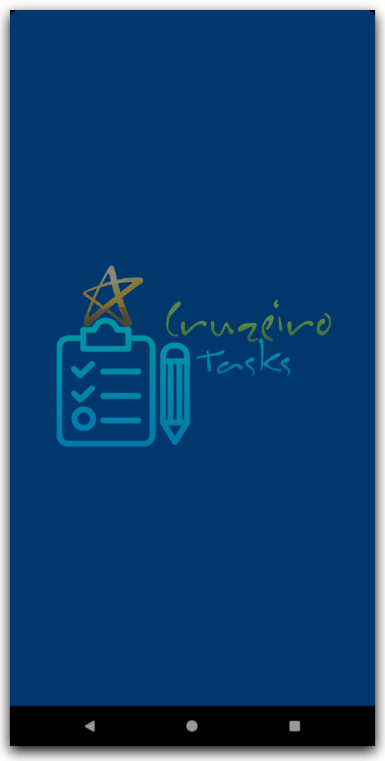

<h1 align="center">
  
  <br>
  CruzeiroTasks
  <br>
</h1>

<p align="center">
  
  
  
  
  
  
</p>

<p align="center">Aplicação para Taréfas Acadêmicas</p>

<br>

<p align="center">
  
</p>


## 📅 Sobre

Ferramenta para auxiliar alunos da Universidade Cruzeiro do Sul com as disciplinas dos cursos na área de Tecnologia da Informação para a sua rotina de estudos, podendo agora adicionar tarefas como provas, trabalhos e outras atividades acadêmicas com o App CruzeiroTasks.

<p align="center">
  
  
</p>
<p align="center">
  
  
</p>

## 🛠 Tecnologias
- [React Native](https://facebook.github.io/react-native/)
- [Javascript](https://devdocs.io/javascript/)
- [Node](https://nodejs.org/en/)
<br/>-
- [moment](https://momentjs.com/)
- [react-native-vector-icons](https://github.com/oblador/react-native-vector-icons)
- [react-native-responsive-screen](https://www.npmjs.com/package/react-native-responsive-screen)
- [react-native-gesture-handler](https://github.com/software-mansion/react-native-gesture-handler)
- [@react-native-community/datetimepicker](https://github.com/react-native-community/datetimepicker)
- [@react-native-community/async-storage](https://react-native-community.github.io/async-storage/)
- [@react-navigation/native](https://reactnavigation.org/)
- [@react-navigation/stack](https://reactnavigation.org/docs/stack-navigator/)

*Foram usados outros, mas esses são os principais.*


## 📱 Executando 

Para executar o projeto é necessário que você tenha o ambiente React Native configurado, você pode seguir esse [GUIA](https://reactnative.dev/docs/environment-setup) para tal.

Depois de configurar o ambiente, basta fazer o clone do projeto:

```sh
git clone https://github.com/jhonbergmann/cruzeiro-tasks.git
```

Entre na pasta do projeto e execute o comando para instalar as dependências do projeto:

```sh
yarn install
```
ou
```sh
npm install
```

Em seguida execute o comando referente a plataforma ao qual deseja executar:

Android:

```sh
react-native run-android
```

## 📝 Licença

Esse projeto está sob a licença MIT. Veja o arquivo [LICENSE](LICENSE) para mais detalhes.

---

<p align="center">
 Feito com 💜 by Jhonatan Bergmann
</p>
